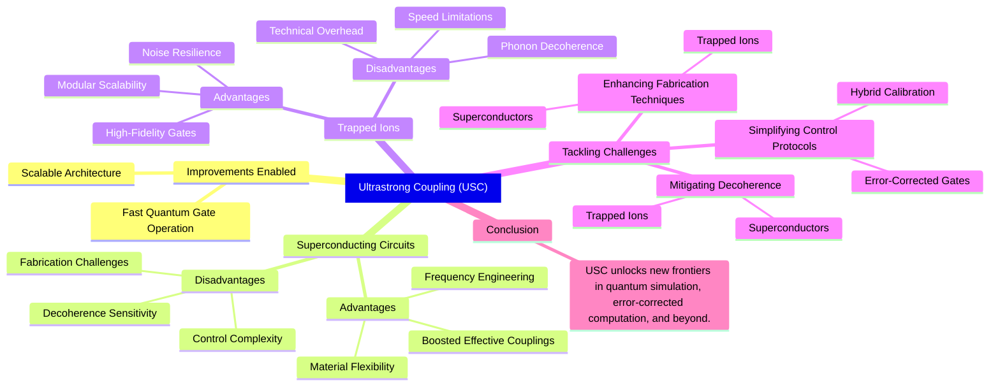

The ultrastrong coupling(USC) regime, where light-matter coupling is comparable to or even greater than the natural frequencies of the system. In this regime, the system no longer follows the Jaynes-Cummings model, showcasing new novel . The advancement of USC applications into superconducting circuits and trapped ions systems provides us with exciting challenges which drives the field closer to the quantum computation era.

## Improvements enabled by USC

### Fast Quantum Gate operation

When the qubit-photon coupling strength becomes comparable to resonator frequency, this enables fast gate operations. For superconducting circuits, counter-rotating terms in the interaction Hamiltonian enables virtual processes that amplify qubit-qubit couplings. For example, two-qubit gates in the nanosecond range have been proposed via multimode resonator buses operating in USC. Similarly, trapped-ion systems leverage USC to mediate entangling gates through phonon-mediated interactions, achieving high-fidelity operations at speeds unattainable in weak or dispersive coupling

### Scalable Architecture 
Superconducting quantum computers face limitations in qubit connectivity, particularly relying on nearest-neighbor interactions. Any method which enables to mitigate this drawback can push forward the superconducting circuits as a promising scalable quantum building units. It has been shown that a scalable design that enables simultaneous connections between multiple distant qubit pairs using a quantum bus coupled via dispersive interactions. The bus structure consists of orthogonal coplanar waveguide resonators interconnected by auxiliary flux qubits operating in the USC regime, leveraging virtual processes to amplify effective qubit-qubit coupling, facilitating quantum gate operations at nanosecond speeds. The authors have stated that this interaction is tunable and designed to maintain qubit coherence throughout operations.

## Advantages and Disadvantages of Ultrastrong Coupling

### **Superconducting Circuits**
**Advantages**: 
- **Boosted Effective Couplings**: Counter-rotating terms enhance qubit-qubit interactions via virtual photons, enabling fast $$\sqrt{i\text{SWAP}}$$ gates with fidelities >99%.  
- **Frequency Engineering**: Multimode resonators with USC allow independent control of hopping and on-site interactions, which enables programmable quantum simulators.
- **Material Flexibility**: Superinductors and plasmonic cavities push impedances near the quantum resistance which minimizes losses.

**Disadvantages**:  
- **Decoherence Sensitivity**: Strong interactions amplify sensitivity to flux noise and dielectric losses, reducing $$T_1$$ and $$T_2$$ times.  
- **Control Complexity**: Breakdown of the rotating-wave approximation demands advanced calibration to mitigate off-resonant driving errors.  
- **Fabrication Challenges**: Integrating Josephson junctions with high-inductance materials requires nanoscale precision in fabrication to avoid quasiparticle dissipation.  

### **Trapped Ions**  
**Advantages**:  
- **High-Fidelity Gates**: USC-mediated phonon interactions achieve fidelities >99.9% for Bell-state generation, leveraging robust spin-motion coupling.  
- **Noise Resilience**: Dynamical decoupling suppresses magnetic dephasing, preserving coherence during transport.  
- **Modular Scalability**: Quantum matter-links enable ion shuttling between modules with infidelity <10$$^{-7}$$.  

**Disadvantages**:  
- **Technical Overhead**: Achieving USC requires precise alignment of motional frequencies and laser intensities, complicating experimental setups.  
- **Phonon Decoherence**: Collective motional modes introduce heating rates that degrade gate performance at scale.  
- **Speed Limitations**: While faster than weak coupling, USC gates remain slower than superconducting counterparts due to finite ion transport times.  

---

## Tackling Challenges in Ultrastrong Coupling Systems  

### **1. Mitigating Decoherence**  
- **Superconductors**: Employ pulsed dynamical decoupling to suppress flux noise. Optimize superinductor materials (e.g., granular aluminum) to reduce quasiparticle densities.  
- **Trapped Ions**: Use sympathetic cooling and segmented trap designs to minimize phonon heating. Implement spin-echo sequences to counteract magnetic field fluctuations.
  

### **2. Simplifying Control Protocols**  
- **Hybrid Calibration**: Combine Quantum optimal control/machine learning with real-time feedback to tune USC parameters.  
- **Error-Corrected Gates**: Leverage bosonic codes to protect against USC-induced leakage errors.  

### **3. Enhancing Fabrication Techniques**  
- **Superconductors**: Well crafted development of  plasmonic cavities can maximize $$g/\omega$$ ratios while minimizing radiative losses.  
- **Trapped Ions**: Integrate photonic interconnects with ion-trap modules for scalable entanglement distribution.  

---

## Conclusion  

Ultrastrong coupling represents a pivotal advancement for quantum computation, offering exponential speedups in gate operations and enabling scalable modular architectures. While challenges in decoherence and control persist, innovations in materials science, error correction, and hybrid calibration are paving the way for practical USC-based devices. For superconducting circuits, the path forward lies in optimizing superinductors and plasmonic resonators, while trapped-ion systems benefit from advanced cooling and transport protocols. As these technologies mature, USC will unlock new frontiers in quantum simulation, error-corrected computation, and beyond.  

